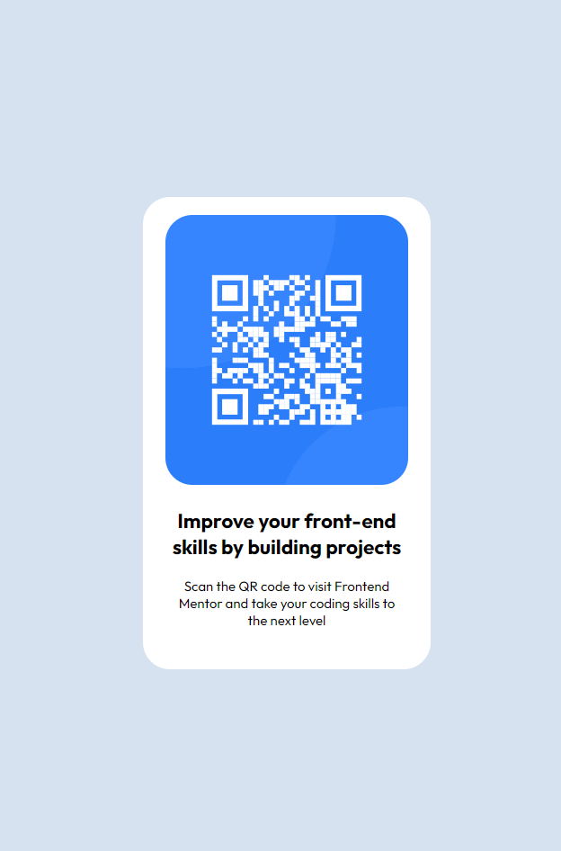

# Frontend Mentor - QR code component solution

This is a solution to the [QR code component challenge on Frontend Mentor](https://www.frontendmentor.io/challenges/qr-code-component-iux_sIO_H). Frontend Mentor challenges help you improve your coding skills by building realistic projects. 

## Table of contents

- [Overview](#overview)
  - [Screenshot](#screenshot)
  - [Links](#links)
- [My process](#my-process)
  - [Built with](#built-with)
  - [What I learned](#what-i-learned)
- [Author](#author)

## Overview

### Screenshot

### Links

- Solution URL: [Solution for this Challenge](https://www.frontendmentor.io/solutions/responsive-qrcode-card-using-css-flexbox-AOkholl3JI)
- Live Site URL: [Github Pages](https://alexurielcontreras.github.io/fem-qr-code-challenge/)

## My process

### Built with

- Semantic HTML5 markup
- CSS 
- Flexbox

## Author

- Website - [Coming soon...]()
- Frontend Mentor - [@AlexUrielContreras](https://www.frontendmentor.io/profile/AlexUrielContreras)
- Twitter - [@AUC829](https://www.twitter.com/AUC829)
